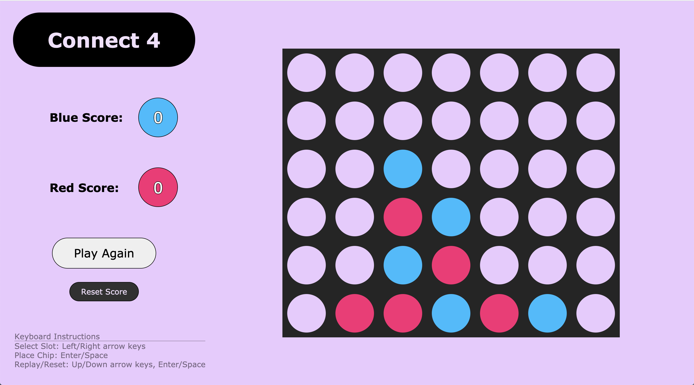
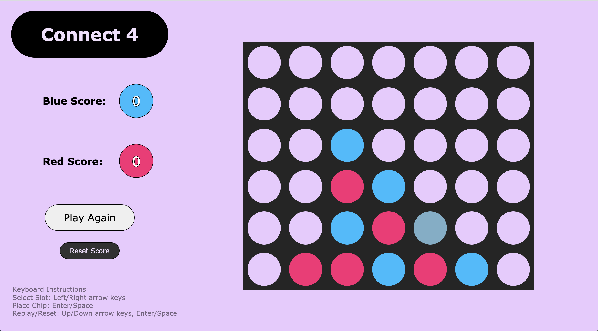
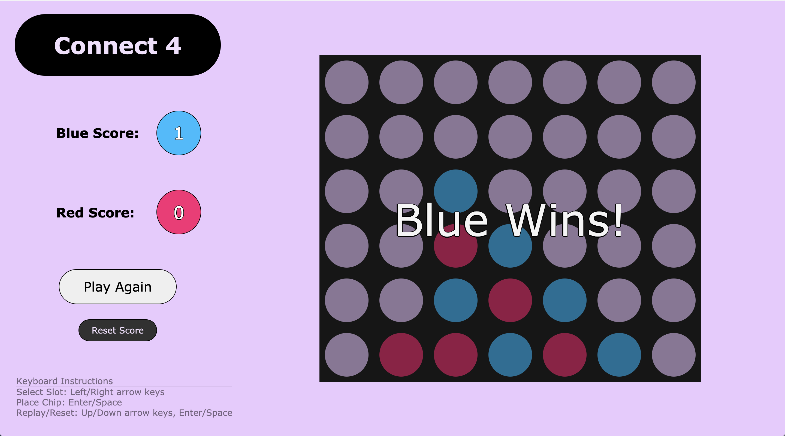
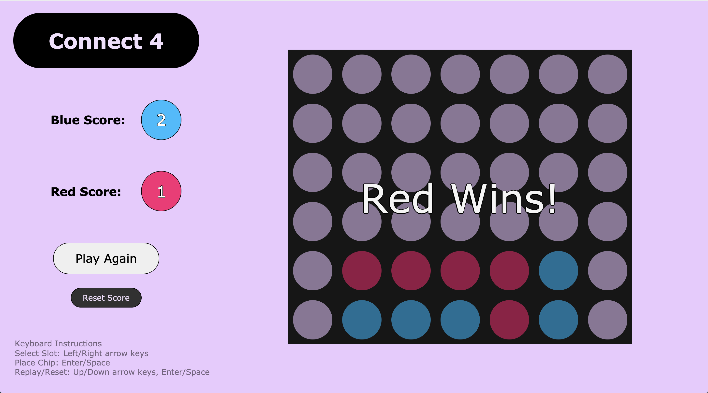
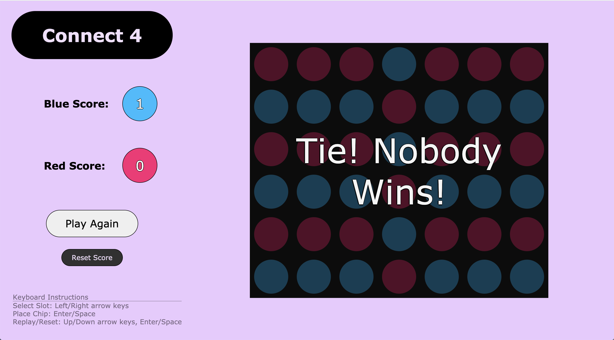

# Connect 4

A two-player game where the first person to align 4 of their chips horizontally, vertically or diagonally wins the game

## Features

-   Playable with keyboard and mouse
-   Score-keeping
-   "Play Again" button - clears the board with a short animation
-   "Reset Score" button - clears board and resets the scores with a short animation
-   Horizontal, vertical, diagonal victory-check
-   Blue- Red- Tie- victory screen
-   Hover-chip indicates whose turn it is and where the placed chip will land

## Tech Stack

-   Javascript
    -   jQuery
-   HTML
-   CSS

## Screenshots

-   Hover-Chip
    

-   Blue Victory Screen
    

-   Red Victory Screen
    

-   Tie Screen
    
